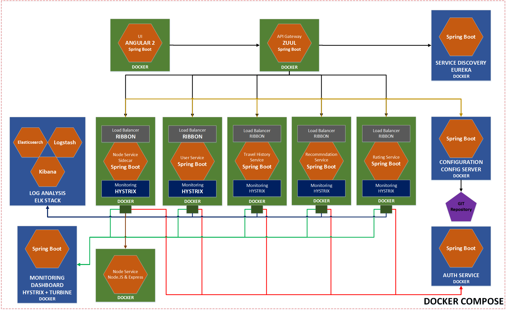

# MICROSERVICES HACKATHON

## PROJECT DESCRIPTION:

The project was initiatied for a Hackathon on Microservices.

It started as a private repository in bitbucket by mere copy of code from below location:

### [https://github.com/shardis/spring-angular2-starter] (https://github.com/shardis/spring-angular2-starter)

We thank the author for sharing this as a open source project which helped us fast track on our jouney in Hackathon which span only 7 days of coding (obviously 2-3 hours a day) after office hours.

We then added good amount of other features which is detailed below in features section.

We wanted to start off as a fork to give full credit to the author but because of multiple reasons was not able to do so. But we want to give the author credit for this, thats the reason for this attribution.

We havent got time to refactor and actually do a fork now but didnt want to keep the code hidden from the communoty which has given us a lot.

Thanks to all who contribute to open source.

This project integrates Spring Boot application containing different Spring cloud components (Netflix OSS) with Angular 2.
Node and npm are installed as part of maven build. Also webpack build and karma tests runs with maven.
It also uses Spring Cloud microservices and Spring Security with Oauth2 JWT tokens.
It also uses docker extensively and each project (each folder) is run as a docker container.

This project is obviously a fork of an existing sample taken from github but this is a good start for our hackathon.

To run the project, do the following:
* Install docker on your machine (mac or windows)
* Clone the repo
* From the root of the project run ``` mvn install -DskipTests```
* If the system complains maven or its version issue, install maven greater than 3.3.3 (in mac i use brew to install maven ``` brew install maven ```)
* Build additional docker images by running ``` docker-compose build ```
* If the build is successful then run the docker compose ``` docker-compose up ```

Note: The docker compose looks into docker-compose.yml and starts the various dockers in a meaningful order

Wait for all the dockers to start successfully (depensing on your system it could take time)

To see if the dockers have registered successfully in discovery service (Eureka) please use the below URL:

### [Eureka: http://localhost:8081](http://localhost:8081)

You should see all the services listed here... (hopefully)

Since all the services are Spring boot, there is another URL which can be used which lists all the Spring boot applications. You can view these in below URL:

### [Spring Boot Application Dashboard: http://localhost:8084](http://localhost:8084)

There is a UI using Angular 2, which can be accesses using below URL (again its a docker based Spring Boot application):

### [LIVE DEMO: http://localhost:8080/](http://localhost:8080/)

## FEATURES:
* Build and testing process integrated with maven
* Spring cloud microservices with service discovery
* Spring security Oauth2 integration
* Docker integration
* Angular Cli integration
* Scss support
* Angular material integration
* Font-awesome integration
* Lazy loaded routes
* Spring Boot admin support
* Spring REST Docs support
* Polyglot Programming (Node microservice)
* Spring sidecar project (for bringing non-java microservice into the ecosystem)
* Polyglot persistence (PostgreSQL & Couchbase)
* Docker based reveal.js presentation
* Multiple microservices based on Spring Boot (Travel history, recommendation, rating and flight)
* Logging & Monitoring by integrating ELK (Elasticsearch, Logstash and Kibana along with Curator) stack
* Integration with Hystrix for Monitoring
* Integration with Turbine again for monitoring multiple streams

## MICROSERVICES:



## RUNNING DEV SERVER FOR DEVELOPMENT MODE:

Run development server:
```
cd michackathon-ui
npm run server
```

Visit your app at http://localhost:4200/

Proxies for api calls can be configured in proxy.json file.
Default configuration assumes that your api is running at localhost:8080

## TESTING ANGULAR FRONTEND

Running unit tests:
```
cd michackathon-ui
npm run test
```

Running e2e tests:
```
cd michackathon-ui
npm run e2e
```
